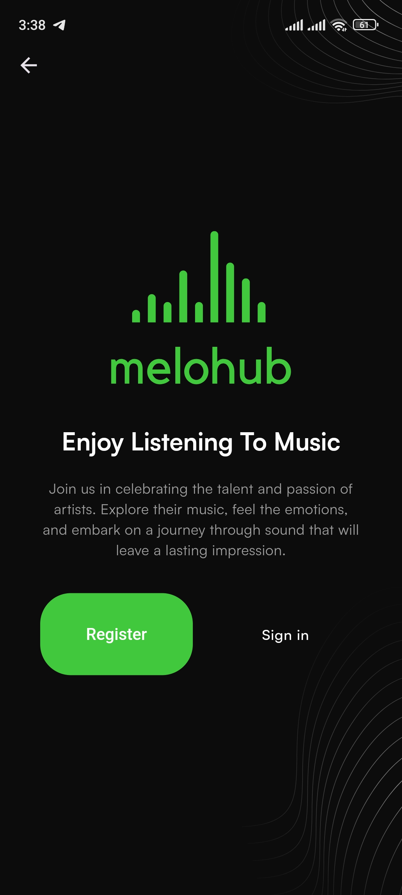
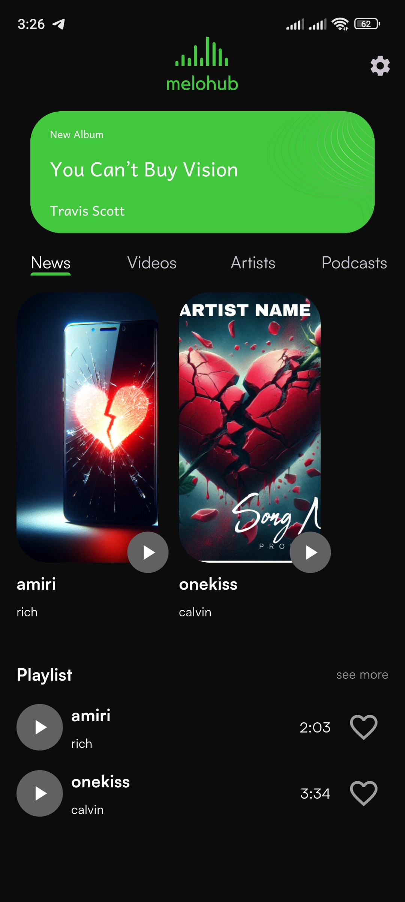
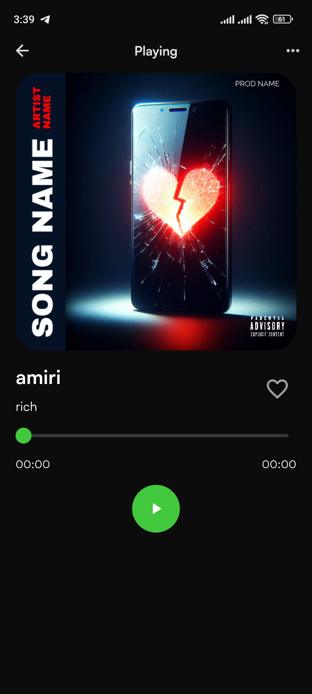

MeloHub App

Welcome to MeloHub! This Flutter project delivers a music streaming experience, featuring a sleek and intuitive interface designed for music lovers. The app includes an integrated song player, album art display.
## Features

- **Song Player**: High-quality song playback with play, pause, and seek functionality.
- **Album Art Display**: Displays dynamic album artwork for the currently playing track.

## ScreenShoots







1. **Clone the Repository**

   ```bash
   git clone https://github.com/developedbyamin/melohub.git
    ```

2. **Navigate to the repository**

    ```bash
   cd melohub
   ```

3. **Install Dependencies**

    ```bash
   flutter pub get
   ```

4. **Run the App**

    ```bash
   flutter run
   ```

  